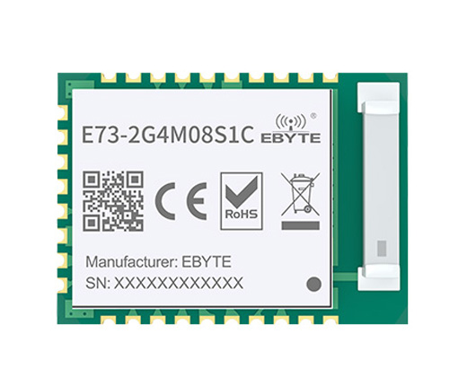
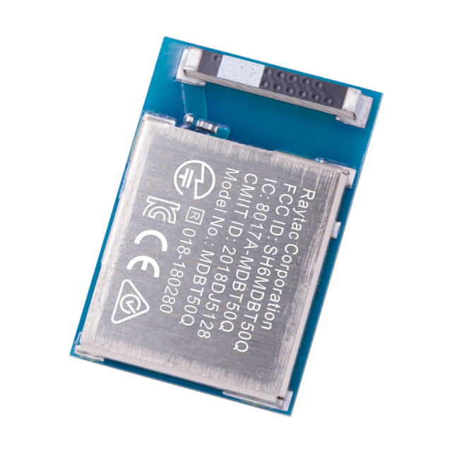

# July 4, 2025

## The Background
I am starting this project with knowledge from hackpad, of making a keyboard pcb, and of making an nRF52840 circuit. Only the hackpad came to fruition, however.
When I made my full-size keyboard for hackboard, I felt that I didn't have as many features as I wanted due to the part budgets so I decided not to submit it and rather use Highway to make a split keyboard.
I began Highway with making an nRF52840 dev board with the same form-factor and pinout as the nice!nano, however halfway through the project, I felt that this was an unnecesarily expensive and unoriginal devboard that had already taken nearly a month. 

## The Keyboard
This keyboard will be a split keyboard with large magnetic connectors inspired by the Joycon 2 connectors using pogo pins to connect to a charging hub that can connect both keyboards together. It will also feature a LED bar above the keys made possible by a 18650 battery. I will also consider adding rotary encoders and a joystick. The keyboard itself will have similar layout to the ZSA Voyager.

## The Microcontroller
First I had to choose between the E73-2G4M08S1C and the MDBT50Q-1MV2, two nRF52840 SMD modules that were basically the same price on [AliExpress](https://www.aliexpress.us/item/3256807191960642.html) and [DigiKey](https://www.digikey.com/en/products/detail/raytac/MDBT50Q-1MV2/13677591) at ~$6.

> E73 on the left, MDBT50Q on the right

The MDBT50Q had only pads under it which were tiny. The E73 had castellated holes making it easier to solder, however it still had pads under it, but they were bigger than the MDBT50Q's pads. I chose the E73 because it was the easiest to solder and I can figure out a way to make them easy to solder or not use them at all.

## The Schematic

Given my knowledge of nRF52840 circuits after my previously attempted project, the nRF was easy to wire on the schematic as the module already came with all the decoupling capacitors (excl. VBUS), inductors, the 32MHz crystal, and the antenna. All I had to add was the VBUS capacitor and an inductor to enable DC/DC mode on REGOUT0. I omitted the 32KHz crystal because it only gives a minimal battery life boost.

For now, I have made the matrix and USB C port on the schematic and some of the keys on the PCB.

**Total time spent: 4h**

# July 8, 2024

This entire 2 hour session was spent on understanding 18650 batteries and finding a battery charger ic.

I did not know whether or not I needed a BMS/protection on my PCB for the 18650 battery as I thought I would be using unprotected 18650 batteries until I found out unprotected batteries are usually only used for battery packs and not small devices. Unprotected batteries lack a PCB built into the battery protecting it from overdischarge which most charger ICs do not have. I decided on using protected 18650 batteries without putting a BMS on the PCB.

Moving onto the charger IC where I spent an HOUR, I ended up choosing the BQ24072. While looking for one, I TRULY did not want to choose a Texas Instruments charger because of their datasheets. I also wanted to try and find an IC in a package with leads because I want this to be fully solderable with a soldering iron. I did find one, the [LTC4000](https://www.analog.com/en/products/ltc4000-1.html) but it was basically unsourceable or was too expensive. Landed on the BQ24072, the least complicated to wire. 

**Total time spent: 2h**

# July 11, 2025

## The Charger

I wanted this to be fully solderable with a soldering iron, so I decided against using a loading sharing/powerpath battery charger IC which only come in packages with no leads. Instead, I decided to use regular battery chargers that have an IN and BAT pin, with no load sharing. To add load sharing, I searched for load sharing circuits with the TP4056 which all included a MOSFET. I then looked at a [video](https://www.youtube.com/watch?v=AwRJsze_9m4) explaining MOSFETs which had me stumped for hours. It only clicked until I watched [this video](https://www.youtube.com/watch?v=o4_NeqlJgOs).

The circuit I am using will be this one from [here](https://blog.zakkemble.net/a-lithium-battery-charger-with-load-sharing/) with a P-channel MOSFET.

This also stumped me for hours because this was very difficult for me to understand as VBAT would be going through drain to source somehow which I didn't know was possible. I learned that it would also make VGS enough to turn on the MOSFET with [this website](https://www.thanassis.space/loadsharing.html) that explains the exact same circuit.

Now another hour was spent on finding a hand-solderable IC and understanding IC packages. I was targetting a SOIC or SOP package but because of those just not existing for some reason and being too expensive when I found one, I had to settle on MSOP packages which have closer pin pitches.

I chose the MCP73833, a 1.1A MSOP battery charger IC. I would have chosen the TP4056 but I literally couldn't find it anywhere. 

## The Wiring

For now this is the charging circuit. I'm unsure what to do with the STAT and PG pins, status pins that sink current for an LED or being detected by an MCU. I'll have to choose an actual MOSFET and Schottky diode which R3 depends on as well.

**Total time spent: 7h**

# July 13, 2025

## The Connector

I will be using pogo pin connectors for this which has to have atleast 5 pins.

- Pins 1 and 5 will be GROUND
- Pins 2 and 4 will be 5V (VDOCK)
- Pin 3 will be PROG (explained in next section)

I could pass the status pins from the battery charger to the dock but that would require at least 2 more pins. The pogo pin connectors rise in cost the more pins.

## The Dock

The dock will have an MCU module inside that can sink current through its GPIOs. 

There is a problem here that can arise at any moment here: The user's charger/power supply cannot supply the current that both keyboards are demanding.

To solve this I would be passing the PROG pin from the keyboard's charger to the dock. The PROG pin controls the charger's charging current for the battery. There will be parallel resistors leading from the pin into multiple GPIOs. The MCU will communicate with a PD controller to figure out how much current to allow the chargers and sink the resistors accordingly.

## The Savior

Moving onto the LDO, I nearly chose an unsuitable 3.3V without realising, the R1172H331B-T1-FE. [This comment](https://www.reddit.com/r/AskElectronics/comments/18urbw4/comment/kfn9r85/) saved me by teaching me about power dissipation. 

At full power, the NeoPixel LEDs I will use can draw up to 60mA each. Using the formula ` Power Dissipation = (Vin - Vout) * Iout `, I can see that I will need at least 1530mW of power dissipation to power 30 LEDs at half power when inputting 5v through USB. I'm not sure yet that I'll use 30 LEDs nor that I'll run at them at half power but I'll be choosing another one.

This is the schematic so far. Since 70 keys is a commonly sold amount of keys, I added an extra column of keys.

**Total time spent: 6h**

# July 14, 2025

## The Lights

After looking at SK6812 RGBW LEDs, I realized that their power supply voltage has to be 3.5v-5.5v, making an LDO somewhat useless here. 

There's a problem here: The 3.7v li-ion battery will operate in a range of 3.0v to 4.2v. The acceptable logic input voltage for the LEDs are `-0.5 ~ VDD+0.5`. When the battery is at 3.8v-4.2v, the 3.3v logic voltage of the nRF's GPIO will be out of range. That is until I saw that WS2812B LEDs work with a logic voltage of 75% of their power supply voltage, meaning 3.3v GPIOs will work when 

## The Design

At this point, I realized my original idea for the LED bar, a straight line, was boring, so I instead tried to make it into a curve... and gave up. Here's a GIF of the attempts (i held down the redo button).

**Total time spent: 4h**

## The Footprints

I forgot to mention that this is a reversible PCB, so it'll need reversible footprints. So far I have used reversible hotswappable MX footprints. I also made my own reversible SOD-123F footprint.

This is meant to be fully hand solderable so I made this footprint with large inner pad slots for the E73 as well.

## The Curve

I decided to attempt making the LEDs curve again, this time with a Bezier curve. I used [this Desmos template](https://www.desmos.com/calculator/cahqdxeshd) to create one where I used measurements of the MX switch bounds to align the LEDs. I then figured out where to place them just by drawing lines along the Y-axis and zoomed in to estimate because Desmos randomly decided that it didn't want to create intersection points. I messed up and restarted only 3 times, a personal record. This took me 4 hours...

**Total time spent: 5h**